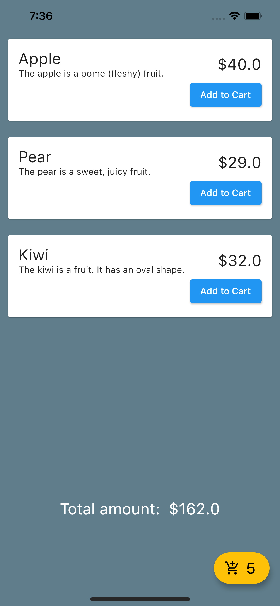

# 
GetX Shopping

An app that uses MVC design pattern and GetX package for state management.

Through this project, I've learned:
-   Model-View-Controller design pattern
-   GetX package and how to use it for state management.

Screenshot of the app:

